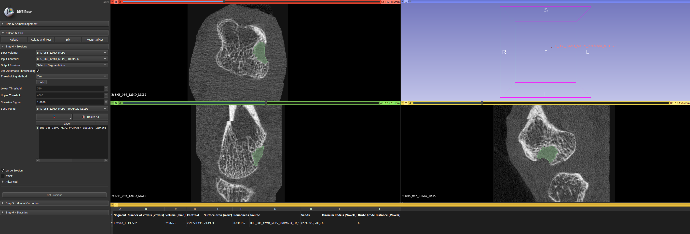

# Bone Analysis Modules (BAM)

This 3D Slicer extension implements algorithms for semi-automated detection of cortical breaks and bone erosions in HR-pQCT images. Additional image analysis tools, such as automatic contouring and image registration are included as well.

These are the modules published in Bone: Zhao M, Tse JJ, Kuczynski MT, Brunet SC, Yan R, Engelke K, Peters M, van den Bergh J, van Rietbergen B, Stok KS, Barnabe C, Pauchard Y, Manske SL. Open-source image analysis tool for the identification and quantification of cortical interruptions and bone erosions in high-resolution peripheral quantitative computed tomography images of patients with rheumatoid arthritis. In Press. [doi.org/10.1016/j.bone.2022.116571](https://doi.org/10.1016/j.bone.2022.116571). While these modules may be updated over time, the original published version is available on [Zenodo](https://zenodo.org/record/6841889).



## Installation

Install this Extension in 3D Slicer, or follow these steps to manually install:
1. Get the latest version of the code. 

cd to the directory where you want to download the code:
```sh
git clone https://github.com/ManskeLab/3DSlicer_Erosion_Analysis.git
```

To update, cd to the directory where you downloaded the code and run git pull:
```sh
git pull
```

2. Install [3D Slicer](https://download.slicer.org/).
3. Open 3D Slicer and go to Edit > Application Settings > Modules. 
4. Expand the box "Additional module paths:" by clicking the arrow on the right side. This shows the “Add” and “Remove” buttons. 
5. Click “Add” and navigate to the directory where you downloaded the erosion analysis toolkits. Choose the directory of each toolkit separately i.e. AutomaticContour; ErosionVolume. 
6. After adding all the toolkits, click OK. Slicer wants to be restarted.
7. After restarting Slicer, the toolkits should be listed in the “Bone” category under the "Modules:" list. An alternative way to access the toolkits is to click the magnifying glass beside the “Modules:” list and search for “Automatic Contour” or “Erosion Volume”. 

## Usage
Refer to [wiki](https://github.com/ManskeLab/Bone_Analysis_Modules/wiki).
