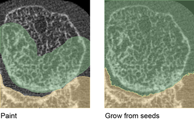
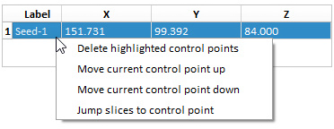
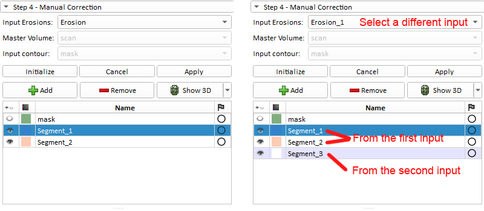

# Usage
This usage file outlines how to use the erosion analysis extension. Only two of the modules are part of the erosion analysis. The first module “Automatic Contour” draws the periosteal bone surface. The second module “Erosion Detection” identifies erosions based on the periosteal bone surface, and the seed points plotted by the user. "Automatic Contour" should run first before "Erosion Detection". 

---

**Load File**

Load a greyscale scan to 3D Slicer through drop file or the Add Data Button. This extension assumes a 61 um isotropic voxel size. It should work with MHA and NIFTI images.

There are three viewer windows in 3D Slicer, coloured in red, yellow, and green. The axial slices of the scan should fall in the red window. If not so, the scan has to be resampled to have that orientation for the extension to work properly. Switch to the built-in module "Resample Scalar/Vector/DWI Volume" to resample images.

---

**Step 1 - Bone Separation**

This step is only necessary if multiple bones in the scan appear to be close or connected to each other. The purpose is to manually separate the bones. If the bones are clearly not connected, then they will be automatically separated by a connectivity component filter in the future steps.

Parameters:
- *Volume to be separated*: the loaded greyscale scan

Hit the "**Initialize**" button, and the editor tools will be activated. 

The goal is to completely cover each bone with a different label. One way to achieve this is to roughly “Paint” each bone on the two end slices as well as a few middle slices, and use the “Grow from seeds” tool to grow the painted labels to the full extent of the scan. Another way is to interpolate the labels with the “Fill between slices” tool. Both ways require the two end slices, i.e. the first and last slices, to be labeled manually. 

Once completed editing, hit the “**Apply**” button. The output will be a label map named with a post-fix “_separated”.

---

**Step 2 – Automatic Contour**

This step is to identify the periosteal bone surface. It takes around one minute to process each bone. 

Parameters:
- *Input Volume*: the greyscale scan
- *Output Contour*: each separate bone will be labeled differently
- *Lower Threshold/Upper Threshold*: global thresholds
- *Number of Bones*: will be used if no *bone separation map* is provided
- *Bone Separation Map*: the output from the previous step

---

**Step 3 – Manual Correction**

This step is to manually correct the periosteal bone surface. 

The user will need to hit the "**Initialize**" and "**Apply**" buttons at the beginning and end of this step.

Parameters:
- *Contour to be Corrected*
- *Master Volume*: the greyscale scan

---

**Step 4 – Erosions**

In this step, erosions will be identified by placing seed points in each of them. Large and small erosions will be identified separately, so the user will run this step multiple times. Each time, the seed points are plotted in erosions of similar size. 

Parameters:
- *Input Volume*: the greyscale scan
- *Input Contour*: the output contour from the previous steps
- *Output Volume*: each erosion will be labeled differently
- *Seed Points*: Each time when placing a seed point, hit the placement button, and left click in the viewer windows where the seed point should go. Manage the seed points using the seed point table, and right click the table to access more actions. Place one or more seed points in the middle of each erosion. Try to keep all the seed points as middle in the erosions as possible.

   

- *Large Erosion*: Check this box if the seed points are plotted in "large" erosions. This determines the internal parameters used in the segmentation. 
- *Advanced* parameters: further adjust the internal parameters used in the segmentation. The defaults should give reasonable result. 

Rerun this step for erosions of different sizes. Plot seed points in different erosions. Create new "Output Volume"s to store erosions of different sizes. 

If the output contains trabecular leakage, increase the *Advanced* parameters. If some erosions are missing, modify the seed points or decrease *Advanced* parameters.

---

**Step 5 - Manual Correction**

The user will be able to manually correct the erosions in this step. Since large and small erosions were identified separately, the erosions scatter among multiple outputs. This step also allows to combine those erosions into a single output. 

The user will need to hit the "**Initialize**" and "**Apply**" buttons at the beginning and end of this step.

The editor is set so that only voxels with low intensities are editable.

Parameters:
- *Input Erosions*: the output from Step 4
- Master Volume: the greyscale scan
- Input contour: the periosteal bone surface

To add erosions from a different output, change the “Input Erosions”, and hit the “Initialize button”. The goal is to combine all the erosions in one bone into a single output.

---

**Step 6 - Statistics**

Statistics are collected. 

Parameters:
- *Input Erosions*: all the erosions in one bone

Only the erosions in the selected “Input Erosions” will appear in the output table.

---

**Save and Reload Files**

Save the periosteal bone surface, the erosion segmentations, and the statistics table through the Save Button. 

When reloading, the label maps/masks, i.e. the periosteal bone surface and the erosion segmentations, need to be loaded as "LabelMapVolume"s. To do so, check the “**Show Options**” check box at the top right corner of the Add Data prompt window, and then check the “**LabelMap**” option.
